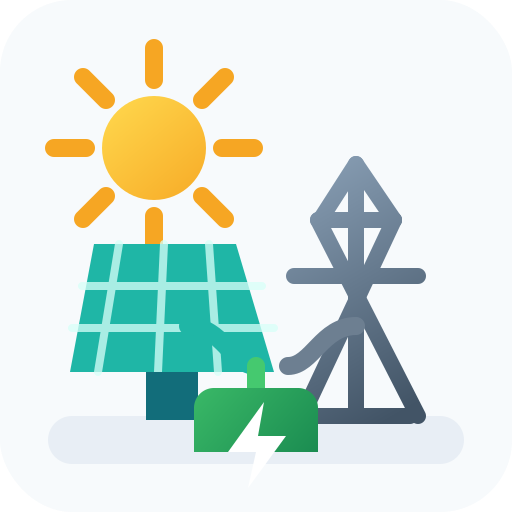

# Solar Load Split



Home Assistant custom integration that splits one device's power usage into:

- Solar-supplied power and energy
- Grid-supplied power and energy

It is designed for UI setup only through Home Assistant's config flow. No YAML setup is required.

## Folder Structure

```text
.
├── hacs.json
├── logo.svg
├── README.md
└── custom_components/
    └── pv_device_split/
        ├── __init__.py
        ├── config_flow.py
        ├── const.py
        ├── discovery.py
        ├── icon.svg
        ├── manifest.json
        ├── sensor.py
        ├── strings.json
        └── translations/
            ├── de.json
            └── en.json
```

## Installation

### HACS custom repository

1. Add this repository to HACS as a custom repository of type `Integration`.
2. Install `Solar Load Split`.
3. Restart Home Assistant.
4. Go to **Settings > Devices & services > Add integration**.
5. Search for **Solar Load Split**.

### Manual

1. Copy `custom_components/pv_device_split` into your Home Assistant `custom_components` folder.
2. Restart Home Assistant.
3. Add the integration from **Settings > Devices & services**.

## Configuration

The first setup flow asks for:

- `grid_power`: the grid power sensor in W
- `invert_grid`: optional boolean for meters where export/import signs are reversed

After this base entry exists, Solar Load Split searches for device power
sensors and offers discovered device entries. Each discovered device entry asks
for:

- `device_power`: the device's power sensor in W

The setup flow and entity names are translated for English and German Home Assistant
installations.

## Discovery

Solar Load Split first needs one manually configured base entry with the grid
import/export sensor. It then scans existing `sensor` entities for device power
sensors using `device_class: power` or power units such as `W` and `kW`.

Grid-like sensors are skipped as device candidates when their entity ID or
friendly name contains common names such as `grid`, `netz`, `meter`, `utility`,
`einspeis`, or `bezug`.

When a likely device sensor is found, Home Assistant can show Solar Load Split
as a discovered integration. The discovered form is prefilled with the suggested
device entity, but the user can still change it before creating the integration.

Home Assistant only runs code for integrations it has loaded. After installation
through HACS, restart Home Assistant and create the first Solar Load Split entry
with the grid sensor. The discovery scan runs from that loaded base entry.

Grid convention after optional inversion:

- Positive grid power means grid import.
- Negative grid power means grid export/feed-in.
- Solar/PV is considered available when the effective grid value is negative.

Deutsch:

- Positiver Netzsensor-Wert bedeutet Netzbezug.
- Negativer Netzsensor-Wert bedeutet Einspeisung.
- Solar/PV gilt als verfügbar, wenn der effektive Netzsensor-Wert negativ ist.
- Wenn dein Zähler die Vorzeichen andersherum liefert, aktiviere `invert_grid`.

## Logic

All source values are expected in watts.

```text
if invert_grid:
    grid_power = grid_power * -1

if grid_power < 0:
    pv_used = min(device_power, abs(grid_power))
else:
    pv_used = 0

grid_used = max(device_power - pv_used, 0)
```

Power sensors are exposed in kW and rounded to 2 decimals.

Energy sensors integrate the calculated power over time and are restored after restart.

## Created Entities

| Entity | Unit | Device class | State class |
| --- | --- | --- | --- |
| `<Device name> PV Power` / `<Gerätename> PV Leistung` | kW | power | measurement |
| `<Device name> Grid Power` / `<Gerätename> Netz Leistung` | kW | power | measurement |
| `<Device name> PV Energy` / `<Gerätename> PV Energie` | kWh | energy | total_increasing |
| `<Device name> Grid Energy` / `<Gerätename> Netz Energie` | kWh | energy | total_increasing |

The energy sensors use `total_increasing`, `kWh`, and the energy device class, so they are compatible with the Home Assistant Energy dashboard.

## Notes

- The integration uses local push updates by listening to changes from the selected source sensors.
- All created entities are grouped under one virtual device.
- Each entity has a stable unique ID based on the config entry ID.
