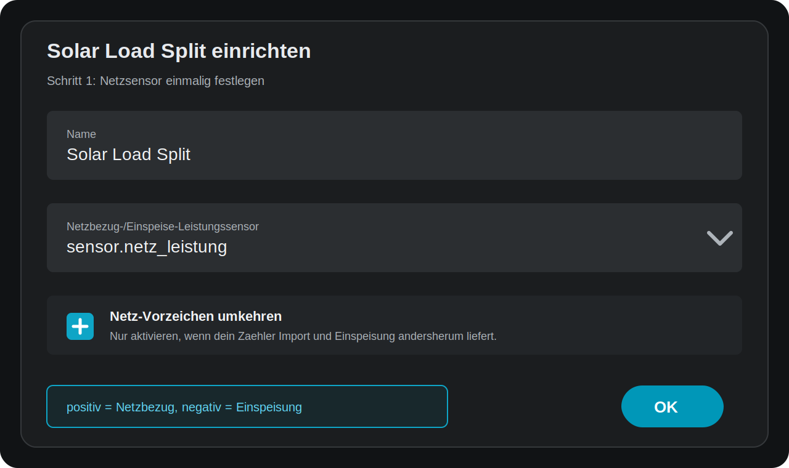
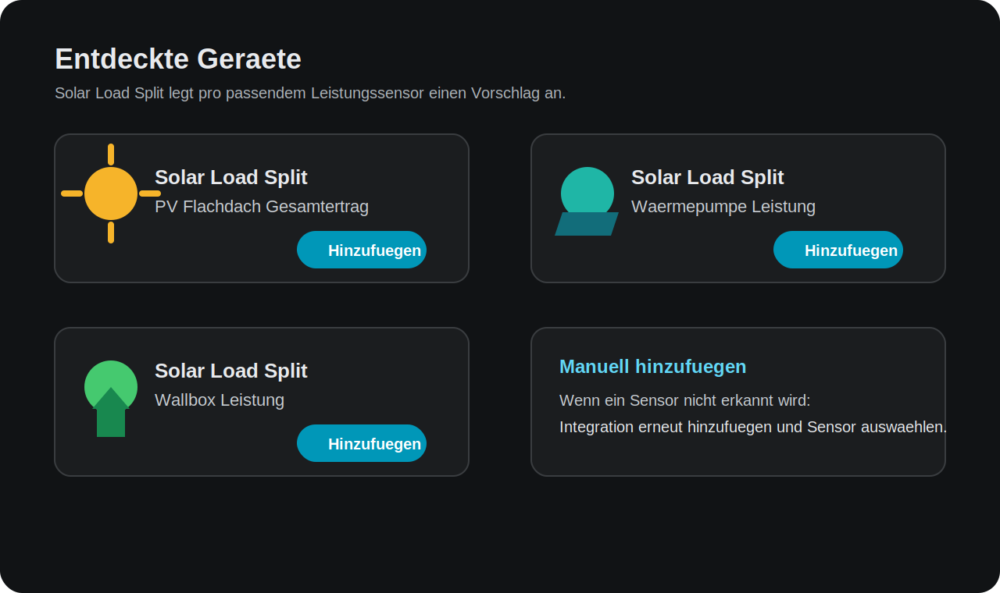
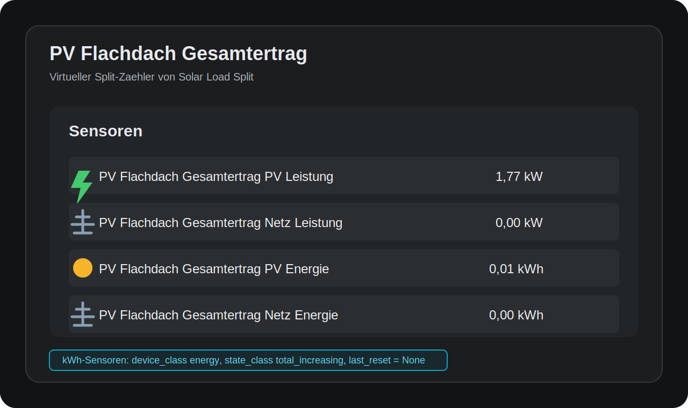

# Solar Load Split


**Solar Load Split** ist eine Home-Assistant Custom Integration fuer HACS. Sie teilt den Verbrauch eines Geraets in zwei Anteile auf:

- Solar/PV-Leistung und Solar/PV-Energie
- Netz-Leistung und Netz-Energie

Die Einrichtung laeuft komplett ueber die Home-Assistant-Oberflaeche. YAML ist nicht noetig.

## Was Macht Die Integration?

Du richtest einmal deinen Netzbezug-/Einspeise-Leistungssensor ein. Danach kann Solar Load Split passende Geraete-Leistungssensoren erkennen oder manuell hinzufuegen.

Aus jedem Geraet entstehen zwoelf Sensoren:

| Sensor | Einheit | Device class | State class |
| --- | --- | --- | --- |
| `<Gerätename> PV Leistung` | kW | power | measurement |
| `<Gerätename> Netz Leistung` | kW | power | measurement |
| `<Gerätename> PV Energie` | kWh | energy | total_increasing |
| `<Gerätename> Netz Energie` | kWh | energy | total_increasing |
| `<Gerätename> PV Tagesenergie` | kWh | energy | total |
| `<Gerätename> Netz Tagesenergie` | kWh | energy | total |
| `<Gerätename> PV Wochenenergie` | kWh | energy | total |
| `<Gerätename> Netz Wochenenergie` | kWh | energy | total |
| `<Gerätename> PV Monatsenergie` | kWh | energy | total |
| `<Gerätename> Netz Monatsenergie` | kWh | energy | total |
| `<Gerätename> PV Jahresenergie` | kWh | energy | total |
| `<Gerätename> Netz Jahresenergie` | kWh | energy | total |

Die kWh-Sensoren sind fuer das Home-Assistant Energy Dashboard vorbereitet:

- `device_class: energy`
- `native_unit_of_measurement: kWh`
- Gesamtzaehler: `state_class: total_increasing`
- Tages-/Wochen-/Monats-/Jahreszaehler: `state_class: total`
- `last_reset = None`

## Bilder Zur Einrichtung

### 1. Netzsensor Einmalig Einrichten



Der Netzsensor muss Leistung in `W` oder `kW` liefern.

Nach optionaler Umkehrung gilt:

- **positiv** = Netzbezug
- **negativ** = Einspeisung
- **PV verfuegbar** = effektiver Netzsensor-Wert ist negativ

Wenn dein Zaehler die Vorzeichen andersherum liefert, aktiviere **Netz-Vorzeichen umkehren**.

### 2. Entdeckte Geraete Bestaetigen



Solar Load Split durchsucht vorhandene `sensor`-Entitaeten nach Leistungssensoren:

- `device_class: power`
- oder Einheit `W` / `kW`

Offensichtliche Netzsensoren werden als Geraetesensor uebersprungen, wenn Name oder Entity-ID typische Begriffe enthalten, zum Beispiel:

- `grid`
- `netz`
- `meter`
- `utility`
- `einspeis`
- `bezug`

Fuer jedes passende, noch nicht konfigurierte Geraet wird ein eigener **Entdeckt**-Eintrag angelegt.

### 3. Erzeugte Sensoren



Alle Sensoren werden unter einem virtuellen Geraet gruppiert. Der Name, den du beim Hinzufuegen vergibst, wird direkt in die Entitaetsnamen uebernommen.

## Installation

### HACS Custom Repository

1. In HACS ein neues benutzerdefiniertes Repository hinzufuegen.
2. Kategorie **Integration** auswaehlen.
3. Repository installieren.
4. Home Assistant neu starten.
5. **Einstellungen > Geraete & Dienste > Integration hinzufuegen** oeffnen.
6. **Solar Load Split** suchen und hinzufuegen.

### Manuelle Installation

1. Den Ordner `custom_components/pv_device_split` nach `config/custom_components/pv_device_split` kopieren.
2. Home Assistant neu starten.
3. **Einstellungen > Geraete & Dienste > Integration hinzufuegen** oeffnen.
4. **Solar Load Split** suchen und hinzufuegen.

## Einrichtung

### Basis-Eintrag

Beim ersten Einrichten fragt Solar Load Split nach:

- `name`: Anzeigename des Basis-Eintrags
- `grid_power`: Netzbezug-/Einspeise-Leistungssensor
- `invert_grid`: optional, wenn dein Netzsensor die Vorzeichen andersherum liefert
- `enable_discovery`: automatische Erkennung aktivieren oder deaktivieren

Dieser Basis-Eintrag erzeugt noch keine Split-Sensoren. Er speichert nur den Netzsensor, der fuer alle Geraete verwendet wird.

### Automatische Erkennung

Nach dem Laden des Basis-Eintrags scannt Solar Load Split vorhandene Leistungssensoren und erstellt Vorschlaege unter **Entdeckt**.

Wenn **Automatische Erkennung aktivieren** ausgeschaltet ist, werden keine Discovery-Vorschlaege erzeugt. Manuelles Hinzufuegen funktioniert weiterhin.

Der Scan laeuft:

- beim Start von Home Assistant
- wenn der Basis-Eintrag geladen wird
- wenn ein Solar-Load-Split-Eintrag geladen wird
- zusaetzlich verzoegert nach dem Start, damit spaet geladene Sensoren erkannt werden

Wenn spaeter neue Leistungssensoren hinzukommen, lade die Integration neu oder starte Home Assistant neu.

### Geraet Manuell Hinzufuegen

Wenn ein Sensor nicht automatisch erkannt wird:

1. **Integration hinzufuegen** oeffnen.
2. **Solar Load Split** erneut auswaehlen.
3. Falls Home Assistant erst eine Auswahlseite zeigt, **Eine weitere Instanz von Solar Load Split einrichten** auswaehlen.
4. Der Dialog **Geraet manuell hinzufuegen** oeffnet sich direkt.
5. Geraete-Leistungssensor auswaehlen.
6. Falls noetig Netzsensor kontrollieren oder auswaehlen.
7. Bestaetigen.

Der Netzsensor und `invert_grid` werden aus dem Basis-Eintrag uebernommen, wenn ein passender Eintrag erkannt wurde. Andernfalls kannst du sie im manuellen Dialog auswaehlen.

### Bestehende Eintraege Aendern

Bereits eingerichtete Eintraege kannst du ueber **Konfigurieren** bearbeiten.

Je nach Eintrag kannst du anpassen:

- Name
- Geraete-Leistungssensor
- Netzbezug-/Einspeise-Leistungssensor
- Netz-Vorzeichen umkehren
- Automatische Erkennung aktivieren

Nach dem Speichern wird der Eintrag automatisch neu geladen.

## Berechnungslogik

Alle Quellwerte werden als Leistung erwartet.

```text
if invert_grid:
    grid_power = grid_power * -1

if grid_power < 0:
    pv_used = min(device_power, abs(grid_power))
else:
    pv_used = 0

grid_used = max(device_power - pv_used, 0)
```

Ausgabe:

- Leistungssensoren in `kW`
- Energiesensoren in `kWh`
- Rundung auf 2 Nachkommastellen

## Ordnerstruktur

```text
.
├── docs/
│   └── images/
│       ├── setup-01-grid.svg
│       ├── setup-02-discovery.svg
│       └── setup-03-entities.svg
├── hacs.json
├── logo.svg
├── README.md
└── custom_components/
    └── pv_device_split/
        ├── __init__.py
        ├── config_flow.py
        ├── const.py
        ├── discovery.py
        ├── icon.svg
        ├── manifest.json
        ├── sensor.py
        ├── strings.json
        └── translations/
            ├── de.json
            └── en.json
```

## Hinweise

- Die Integration ist UI-only.
- Die Integration ist HACS-kompatibel.
- Deutsch und Englisch werden ueber Home-Assistant-Translations unterstuetzt.
- Jeder Split-Eintrag hat stabile Unique IDs.
- Bestehende Entitaetsnamen werden von Home Assistant im Entity Registry gespeichert. Wenn du Namen nach einem Update testen willst, loesche den betroffenen Eintrag und fuege ihn neu hinzu oder setze die Namen manuell zurueck.

## English Short Version

Solar Load Split is a HACS-compatible Home Assistant custom integration. It splits one device power sensor into solar/PV usage and grid usage.

Setup is UI-only:

1. Add Solar Load Split once and select the grid import/export power sensor.
2. Positive grid power means import, negative grid power means export/feed-in.
3. Confirm discovered device power sensors or add a device manually by adding Solar Load Split again.
4. Each device creates PV power, grid power, PV energy, and grid energy sensors.

Energy sensors use `kWh`, `device_class: energy`, `state_class: total_increasing`, and `last_reset = None`.
